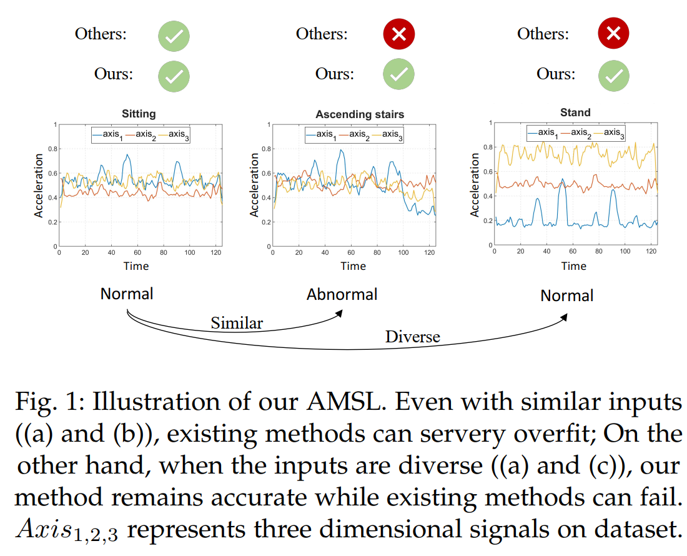

### AMSL: Adaptive Memory Networks with Self-supervised Learning for Unsupervised Anomaly Detection

This paper has been accepted by TKDESI 2021（Special Issue on Anomaly Detection in Emerging Data-Driven Applications Motivation）as regular paper. The authors are Yuxin Zhang, Jindong Wang, Yiqiang Chen, Han Yu, Tao Qin. 

> https://arxiv.org/pdf/2201.00464.pdf

Unsupervised anomaly detection aims to build models to effectively detect unseen anomalies by only training on the normal data. Although previous reconstruction-based methods have made fruitful progress, their generalization ability is limited due to two critical challenges. First, the training dataset only contains normal patterns, which limits the model generalization ability. Second, the
feature representations learned by existing models often lack representativeness which hampers the ability to preserve the diversity of normal patterns (see Fig.1). In this paper, we propose a novel approach called Adaptive Memory Network with Self-supervised Learning (AMSL) to address these challenges and enhance the generalization ability in unsupervised anomaly detection. Based on the convolutional autoencoder structure, AMSL incorporates a self-supervised learning module to learn general normal patterns and an adaptive memory fusion module to learn rich feature representations. Experiments on four public multivariate time series datasets demonstrate that AMSL significantly improves the performance compared to other state-of-the-art methods. Specifically, on the largest CAP sleep stage detection dataset with 900 million samples, AMSL outperforms the second-best baseline by 4%+ in both accuracy and F1 score.
Apart from the enhanced generalization ability, AMSL is also more robust against input noise.

### Proposed Approach

 Fig.2: The structure of the proposed AMSL.

We propose a novel Adaptive Memory Network with Self-supervised Learning (AMSL) for unsupervised anomaly detection. AMSL consists of four novel components as shown in Fig. 2: 1) a self-supervised learning module, 2) a global memory module, 3) a local memory module and 4) an adaptive fusion module.

### Comparison Methods

 TABLE 3 The comparison of mean precision, recall, F1 and accuracy of AMSL and other baselines. 

TABLE 3 reports the overall performance results on these public datasets. It can be observed that the proposed AMSL method achieves significantly superior performance over the baseline methods in all the datasets. Specifically, compared with other methods, AMSL significantly improves the F1 score by 9.07% on PAMAP2 dataset, 4.90% on CAP
dataset, 8.77% on DSADS dataset and 2.35% on WESAD dataset. The same pattern goes for precision and recall. Especially for the largest CAP dataset with over 900 Millon
samples, AMSL dramatically outperforms the second-best baseline (OCSVM) with an F1 score of 4.90%, indicating its effectiveness.